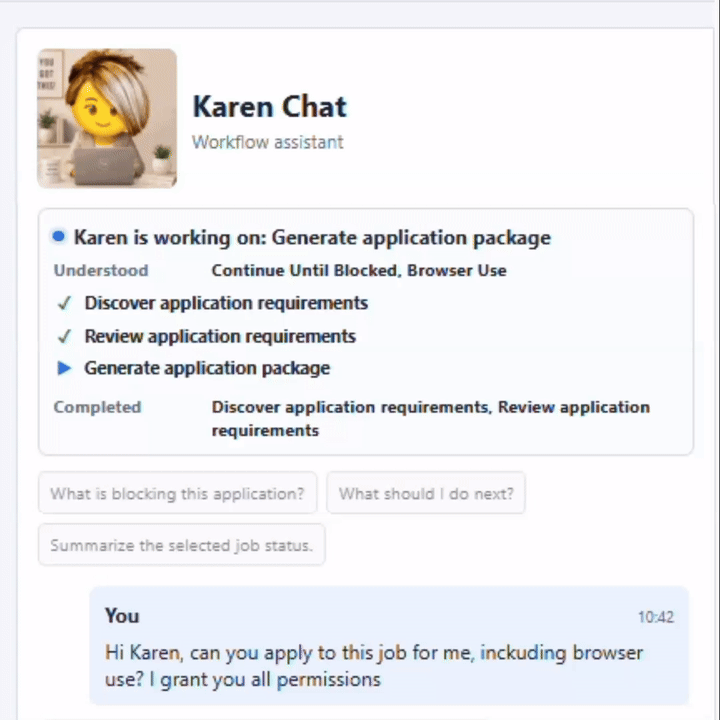
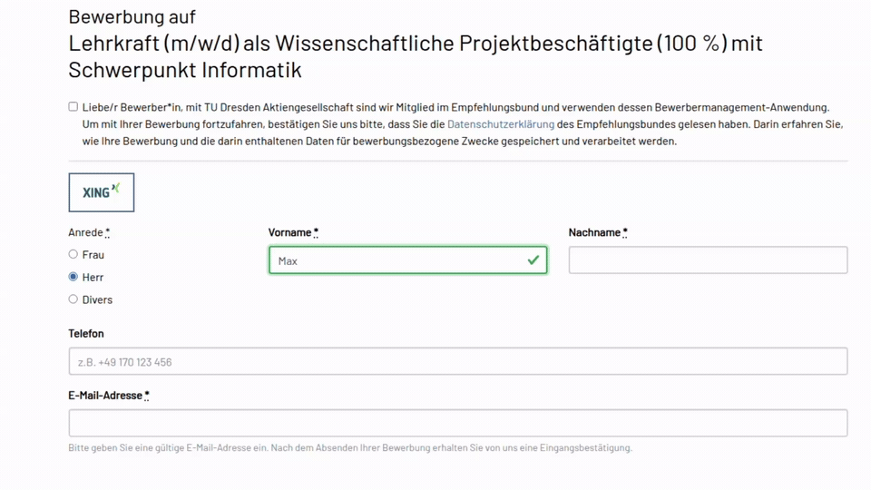

# Hi, I'm Javier 👋  
Software Testing & Automation Engineer → AI Integration Engineer | Munich 🇩🇪

My strength is combining **hands-on technical work with a broader view of the software development lifecycle**. I have worked across manual testing, test automation, test infrastructure, tooling, and test leadership, which gives me a practical understanding of how software is built, validated, delivered, and maintained.

**I use gen AI, LLMs, and agents where language reasoning adds value, and deterministic code where the task is deterministic.**

My approach is pragmatic: I prototype fast enough to validate ideas, then harden the parts that matter.
That means making workflows easier to observe, reproduce, adapt, and verify — with clear errors, status tracking, repeatable commands, wrappers around external services, tests, and validation.

---

## 🧭 What I care about

- **Traceability and observability** — inputs, outputs, decisions, failures, and status should be inspectable
- **Practical usefulness** — tools should solve actual workflow pain, not just look impressive
- **Validation and regression safety** — important behavior should not just be trusted blindly from AI or developers, but protected by reproducible checks, tests, hooks, and CI
- **Clear, testable boundaries** — core logic should be separated from external dependencies so systems are easier to test, debug, and extend
- **Reusable quality standards** — recurring architecture patterns should become templates, checks, and documentation instead of being rebuilt manually each time
- **Scalable design** — workflows should be modular enough to grow in complexity without requiring major rewrites or mixing unrelated responsibilities

---

## Projects

### 🤖⭐ Agentic Job Application System ⭐🚀

An agentic job application LangGraph workflow where **Karen** and the **human user** can both guide the process. The system takes a job URL and candidate data, analyzes the role requirements, prepares tailored application data, and attempts the application through controlled browser automation with validation and review points.

**Link to project:** [job_search_automation](https://github.com/portero-aylagas/job_search_automation)

<pre>
Human 🧑🏼‍💼 / 🤖 Karen
▼
Job URL + CV
▼
Tailored application data (cover letter...)
▼
Browser automation: forms, candidate data, attachments
</pre>

#### What it does

| Area | Capability |
| --- | --- |
| Candidate profile | Structures CV and supporting document data. |
| Job intake | Extracts job details from a URL for review. |
| Requirements discovery | Finds required uploads, fields, and questions. |
| Application package | Drafts cover letters, answers, messages, notes, and checklists. |
| Fill plan | Maps reviewed data to application fields. |
| Karen assistant | Explains blockers and can trigger approved workflow actions. |
| Tracker | Keeps saved jobs and statuses visible. |

<table>
  <tr>
    <td>
      <b>Karen prepares the application</b> 
      Karen analyzes the position requirements and candidate profile/CV, then prepares tailored application data for the selected role.
    </td>
    <td align="center">
      
    </td>
  </tr>
  <tr>
    <td>
      <b>Agentic browser application</b> 
      The system attempts the application through browser navigation: filling forms, adding candidate data, and attaching required files.
    </td>
    <td align="center">
      
    </td>
  </tr>
</table>

---

## Reusable Engineering and AI SW quality skills/templates

### Claude Code / Codex Skills for Software Quality & AI-Assisted Development

| Project | What it does | GitHub |
|---|---|---|
| **Safe Project Improvement Skill** | Reusable development-support skill I built to improve software projects with controlled AI assistance. It can be applied to any repository to review quality, identify risks, plan small improvements, and guide safe incremental changes.  **SW engineering:** architecture, module boundaries, function responsibility, error handling, validation, testability, documentation, repository hygiene, security, and secrets handling.  **AI-integrated projects:** prompt quality, structured outputs, LLM/API boundaries, RAG/retrieval, agent tools, evaluation, and cost/usage tracking. | [Link](https://github.com/portero-aylagas/agent_skill_safe_project_improvement_system) |

---

### AI Project Architecture & Templates

| Project | What it does | GitHub |
|---|---|---|
| **AI Project Templates** | Reusable starter architectures for AI-integrated software projects. The repository turns repeated AI project patterns into copyable templates with separated prompts, Pydantic schemas, provider boundaries, fake-client tests, FastAPI UI, documentation, GitHub Actions, and `make verify` gates.  **Checked project archetypes:** direct LLM calls, RAG applications, LangChain tool-using agents, LangGraph stateful workflows, MCP agents, and human-in-the-loop review workflows. | [Link](https://github.com/portero-aylagas/AI_project_templates) |

---

### Applied AI Applications

| Project | What it does | GitHub |
|---|---|---|
| **AI Market Intelligence Report Generator** | Generates market-intelligence reports from local knowledge-base files. It builds context from selected markets, sections, and time periods, creates a structured Markdown report, and supports iterative revision through user feedback. | [Link](https://github.com/portero-aylagas/project2_content_creation) |
| **AI Podcast Studio** | Turns PDFs, URLs, pasted text, or combined sources into a short two-speaker podcast. It extracts and summarizes the source material, transforms it into a dialogue, generates MP3 audio, and exports a transcript. | [Link](https://github.com/portero-aylagas/project1_podcast) |

---

### Agentic Workflows

| Project | What it does | GitHub |
|---|---|---|
| **MCP Integration with LangChain** | The agent connects to MCP servers and uses filesystem, Git, and Trello tools through a standard tool interface. It reads local documents, inspects repository state, and creates Trello tasks. | [Link](https://github.com/portero-aylagas/MCP_in_LangChain) |
| **LangGraph Complaint Workflow** | The agent processes complaint messages through a fixed LangGraph workflow. It classifies the complaint, extracts intake details, validates category-specific issues, investigates the case, generates a resolution record, and closes the workflow with a structured summary. | [Link](https://github.com/portero-aylagas/LangGraph_NormalObjects_Creative_Complaint_Handler) |
| **LangChain Complaint Handler** | The agent receives a complaint, selects from available tools and data sources, retrieves the relevant information, and produces a response. This is the earlier free-tool-selection version of the complaint workflow. | [Link](https://github.com/portero-aylagas/Agentic_AI_Creative_Complaint_Handler_LangChain) |

---

### RAG & Retrieval

| Project | What it does | GitHub |
|---|---|---|
| **Trustworthy AI RAG Pipeline** | Builds a retrieval-augmented generation pipeline over a Trustworthy AI PDF and podcast transcript. It converts the PDF to Markdown, transcribes audio, chunks both sources, stores embeddings in Pinecone, retrieves relevant content, applies LLM relevance scoring, and generates grounded answers. | [Link](https://github.com/portero-aylagas/RAG_relevance_scoring_and_rerankers) |
| **PDF Chunking for RAG** | Prepares long PDF content for retrieval by comparing chunking strategies on a Trustworthy AI document. The focus is document preparation before indexing and retrieval. | [Link](https://github.com/portero-aylagas/RAG_chunk_podcast_and_pdf) |

---

### n8n Workflow Automation

| Project | What it does | GitHub |
|---|---|---|
| **Telegram to Airtable Workflow** | Receives Telegram bot messages, normalizes the message data, and stores structured records in Airtable through an n8n workflow. | [Link](https://github.com/portero-aylagas/n8n_multiapp_integration) |

---

## 🧰 Tools and technologies

**Agentic workflows:** `LangChain` `LangGraph` `MCP` `Tool Use` `Browser Automation` `Playwright`  
**RAG & retrieval:** `Embeddings` `Vector Search` `Pinecone` `Metadata Filtering` `Relevance Scoring` `Reranking`  
**AI project architecture:** `Pydantic` `FastAPI` `Provider Boundaries` `Prompt Files` `Structured Outputs` `Fake Clients`  
**Software engineering:** `Python` `Git` `GitHub` `REST APIs` `Make` `GitHub Actions`  
**Quality & testing:** `pytest` `Ruff` `Test Automation` `Fixtures` `CI Verification`  
**Workflow automation:** `n8n` `Telegram Bot API` `Airtable` `Trello API`  
**Document & audio processing:** `PDF Extraction` `Web Scraping` `BeautifulSoup` `Whisper` `TTS`

---

## 📫 Connect

